# Intranet - Rodrigo Sousa Developer.

  

## Sumário 

* [Descrição do Projeto](#descrição-do-projeto)
* [Tecnologias Utilizadas](#tecnologias-utilizadas)
* [Visual & Funcionalidade](#visual--funcionalidade)
   * [Menu de navegação](#menu-de-navegação)
   * [Carrossel](#carrossel)
   * [Arquivos importantes](#arquivos-importantes)
   * [Nossos valores](#nossos-valores)
   * [Aniversariantes do mês](#aniversariantes-do-mês)
   * [Canal Condifencial](#canal-confidencial)
   * [Rodapé](#rodapé)
* [Login - Canal Confidencial](#login---canal-confidencial)

* [Referências](#referências)

---

# Descrição do projeto

Este projeto se originou como uma forma de auxiliar na comunicação que a empresa tinha para com os funcionários, na qual antes da inplantação do mesmo, era feita por intermédio de e-mail, algumas vezes dificultando a propagação das informações; alguns colaboradores não conseguiam visualizar e/ou "perdiam" os mesmos. Como forma de centralizar informações comum da companhia e centralizar o canal de comunicação, assim como a Internet tem por intuito interligar computadores para fornecer aos usuário o acesso a diversas informações; a Intranet foi desenvolvida com esse mesmos intuito. 

O projeto foi realizado após uma analise da necessidade que a empresa tinha em melhorar a comunicação e divulgação das informações em um canal centralizado. Como amo tecnologia e estou estudando desenvolvimento; foi apresentando a ideia e após consumir diversas aulas, foi possível a realização do presente projeto e aplicação na empresa que trabalho. Sendo aqui representando com a troca dos nomes da empresa pela sigla **RDS**, que é um acrônimo do nome **Rodrigo Sousa Developer**.

# Tecnologias utilizadas

- Framework _`Bootstrap`_.
- `HTML 5`
- `CSS3`
- `Javascript`
- `PHP`
- `MySQL`

# Visual & Funcionalidade

### Menu de navegação

A primeira parte da página é o menu para ajudar na navegação entre os conteúdos estão contido na página e são mais relevantes para a companhia. Sendo apresentado no lado esquerdo o logo da empresa, que ao descansar o mouse sobre o mesmo, há uma animação do icone ("saltar"). Nos demais links, temos o site para verificar a folha de pagamento, que é realizada pelo site externo da ADP. O menu dropdown com algumas pastas. A pasta **Formulário padrões** tem alguns links que são baixados quando clicados. A **Pasta Empresas** possui os arquivos das empresas que fazem parte da companhia, no qual há dados e para pesquisar pode ser feito o scroll nesse dropwon, ou começar a digitar o nome que deseja que pelo Javascript será apresentado os links que possuirem a letra ou o nome correspondete, se houve. Temos como última opção do menu o link para o **Canal confidêncial**, sendo uma âncora na mesma página.

Utilizando da Bootstrap, já deixamos o menu de navegação de forma responsiva, que ao se aberto/renderizado em telas com tamanhos menores, o menu é recolhido e apresentado o botão para ser clidado quando desejar visualizar.

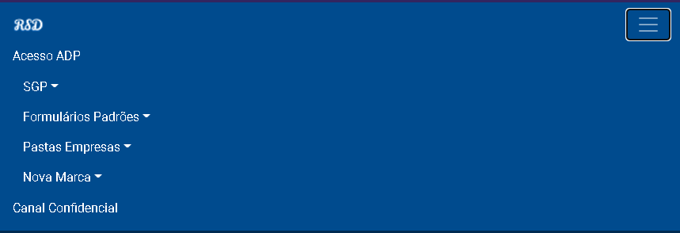

### Carrossel

No carrossel são apresentandos os banners com as novidades da companhia. Exemplo um menu com os aniversariantes do mês; novidades sobre datas comemorátivas. No qual usufruímos do bootstrap para ter as imagens passando com o efeito de slide, tendo as setas do lado esquerdo para voltar e a do lado direto para avantar entre os slides. E dentro do carrossel os botões mostrando quantos slides têm e qual está ativo.

### Arquivos importantes

Nesta parte temos os links e materiais da companhia. Como a lista de ramal, o link para acompanhar os chamados junto ao ERP que a companhia utiliza; o arquivo ESG. Os itens da lista (que são apresentando fazendo uso do _font answer_) ao passar o cursos do mouse sobre eles mudam de cor e com a animação eles pulam.

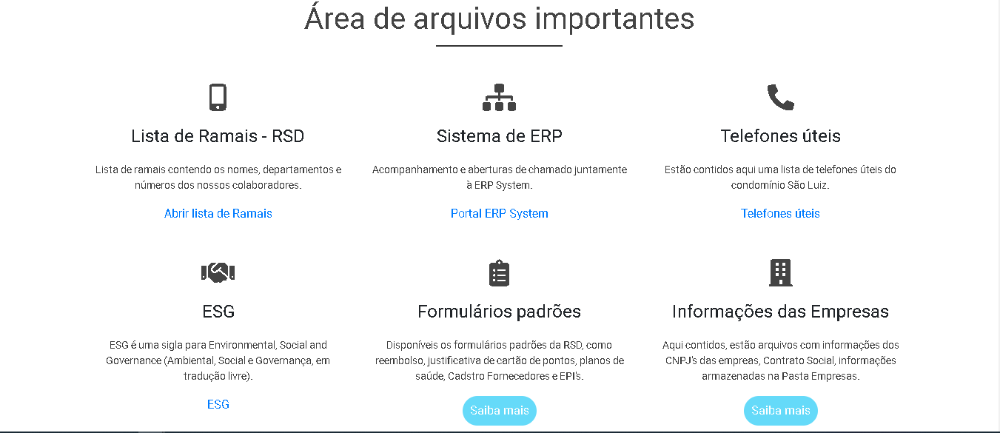

### Nossos valores

Aqui são apresentandos os valores que a Companhia possui, com uma animação da imagem que parece que ao scrolar temos a impressão de que a imagem de fundo está se mexendo. Esse efeito é realizado utilizando o Javascript.

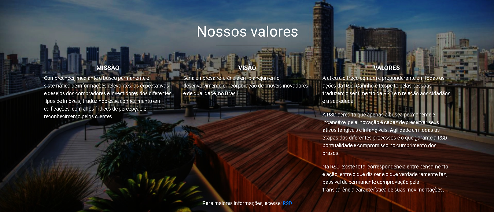

### Aniversariantes do mês

Esta parte foi desenvolvida 1 mês após a publicação da intranet e os colaboradores irem utilizando; visto que no começo do mês era disparado um e-mail para toda a companhia com uma lista dos aniversariantes (sendo a mesma disponível na intranet como banner), para ficar mais intuitivo inserimos todos os colaboradores da companhia, junto com 12 botões, cada um representando um mês, para que ao clicar ele exiba apenas os aniversariantes do mês selecionado. E se desejar enviar um e-mail para um dos colaboradores, bata clicar no e-mail logo abaixo da imagem que será aberto o programa de e-mail padrão da sua máquina com o assunto **Feliz aniversário** já escrito. 

Descansando o mouse sobre uma imagem, ele aumenta a mesma para melhorar a visualização, ao retirar o cursor a imagem retorna ao seu tamanho padrão.

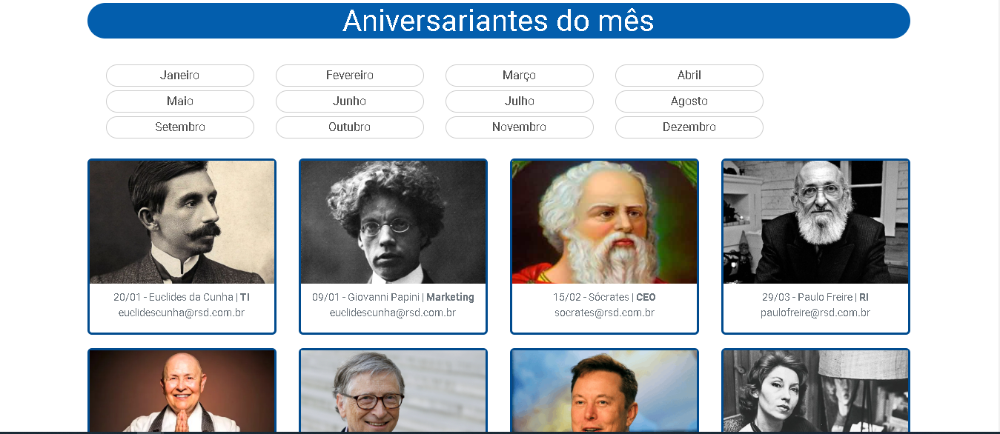

### Canal Confidencial

Este campo é disponibilizado para receber denuncias e/ou sugestões, no qual é preciso preencher o assunto e a mensagem. Se tentar enviar algo sem preencher esses campos irá apresentar uma mensagem solicitam que preencha o campo para poder enviar. 

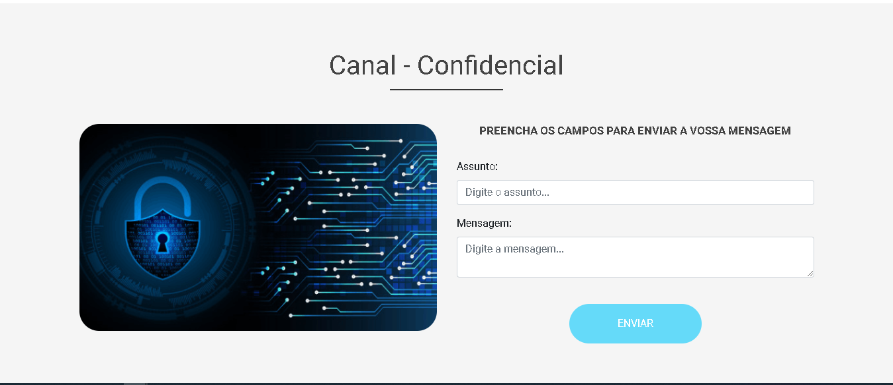

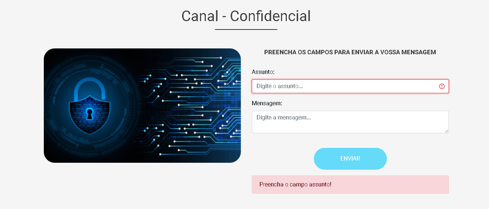

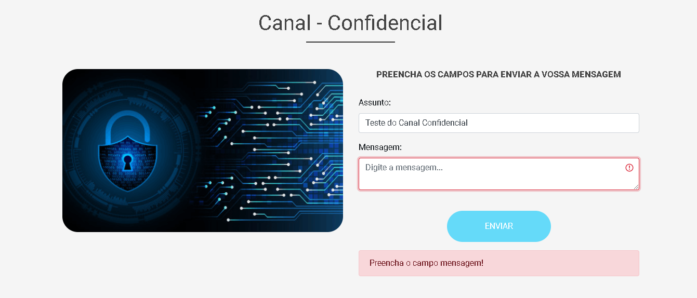

Ao preencher os campos e clicar em **Enviar**, será apresentando uma mensgem falando que foi registrado e redirecionado para a intranet novamente.

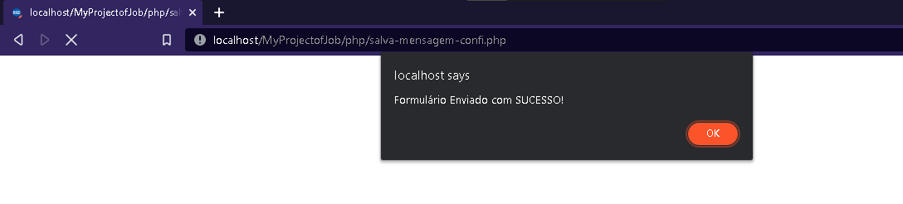

### Rodapé

Aqui temos o rodapé da página, com os links para continuar acompanhando a empresa nas mídias sociais. Contendo o ano e o nome da equipe que desenvolveu a página.

### Login - Canal Confidencial

Para acessar os conteúdos que foram enviados pelo **Canal Confidencial**, temos página desenvolvida em PHP com validações, para só serem acessadas se o usuário for autenticado, inserindo o usuário e senha que estiver cadastrado no Banco de Dados (MySQL).

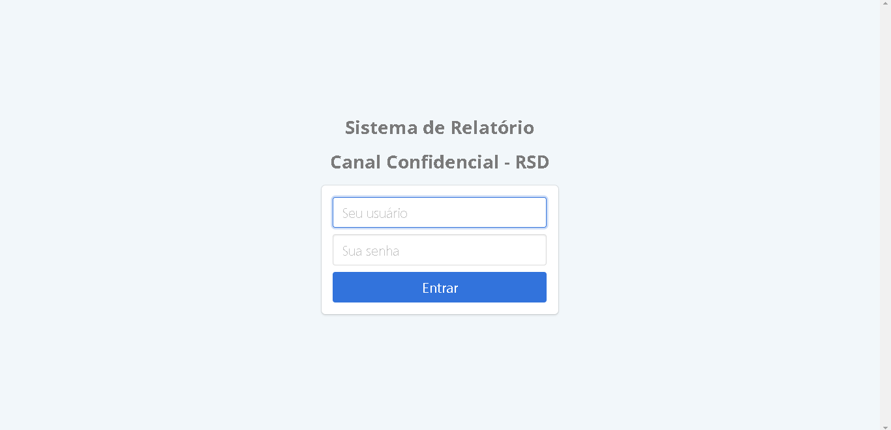

Painel após logar, para poder gerar o relatório

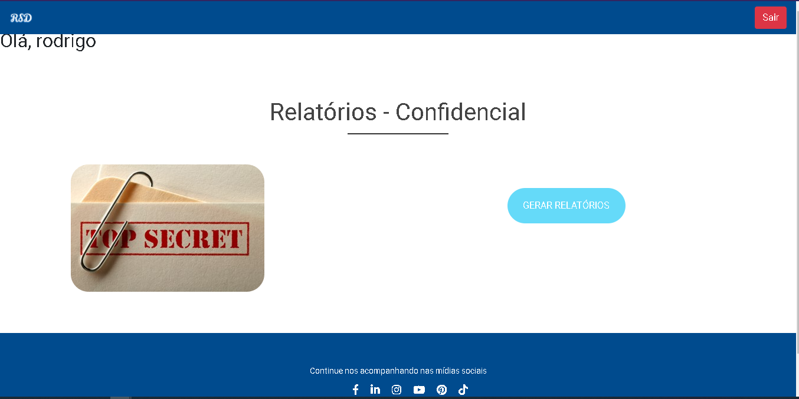

Ao clicar no botão para relatório, irá ser aberto uma outra aba listando todas as mensagem que foram recebidas pelo banco de dados. Com assunto, mensagem e data e hora do envio.

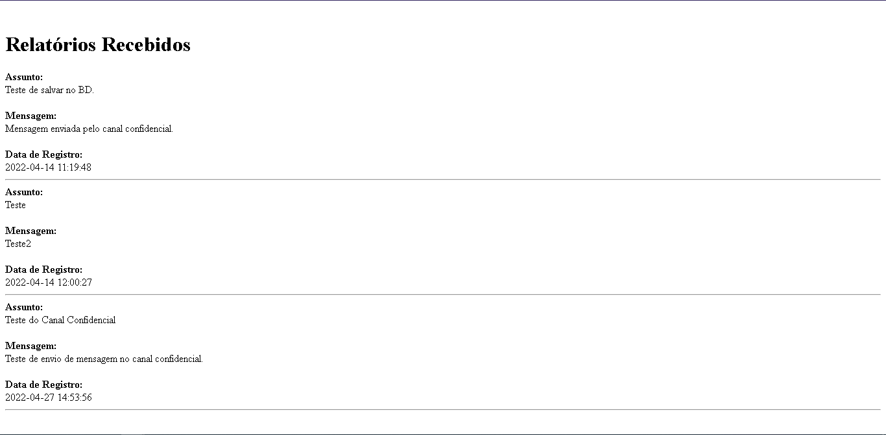

#### Referências 
@matheusbattisti, no qual explica como utilizar o framework do `Bootstrap`, no canal do YouTube [Curso Bootstrap](https://www.youtube.com/watch?v=SmQMZ36hJJY&list=PLnDvRpP8Bnexu5wvxogy6N49_S5Xk8Cze).

A tela de login, para verificarmos o que foi preenchido na parte do **Canal Confidencial**, construimos com o auxilio @celkecursos.

