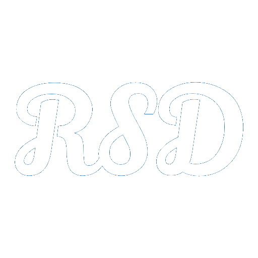

# Intranet - Rodrigo Sousa Developer.

  

* [Título e imagem do README.md](#intranet---rsd)
* [Descrição do Projeto](#descrição-do-projeto)
* [Tecnologias Utilizadas](#tecnologias-utilizadas)

---

# Descrição do projeto

Este projeto se originou como uma forma de auxiliar na comunicação que a empresa tinha para com os funcionários, na qual antes da inplantação do mesmo, era feita por intermédio de e-mail, algumas vezes dificultando a propagação das informações; alguns colaboradores não conseguiam visualizar e/ou "perdiam" os mesmos. Como forma de centralizar informações comum da companhia e centralizar o canal de comunicação, assim como a Internet tem por intuito interligar computadores para fornecer aos usuário o acesso a diversas informações; a Intranet foi desenvolvida com esse mesmos inuito. 

O projeto foi realizado após uma analise da necessidade que a empresa tinha em melhorar a comunicação e divulgação das informações em um canal centralizado. Como amo tecnologia e estou estudando desenvolvimento; foi apresentando a ideia e após consumir diversas aulas, foi possível a realização do presente projeto e aplicação na empresa que trabalho. Sendo aqui representando com a troca dos nomes da empresa pela sigla **RDS**, que é um acrônimo do nome **Rodrigo Sousa Developer**.

# Tecnologias utilizadas

- Framework _`Bootstrap`_.
- `HTML 5`
- `CSS3`
- `Javascript`
- `PHP`
- `MySQL`

#### Referências 
@matheusbattisti, no qual explica como utilizar o framework do `Bootstrap`, no canal do YouTube [Curso Bootstrap](https://www.youtube.com/watch?v=SmQMZ36hJJY&list=PLnDvRpP8Bnexu5wvxogy6N49_S5Xk8Cze).

A tela de login, para verificarmos o que foi preenchido na parte do **Canal Confidencial**, construimos com o auxilio @celkecursos.

